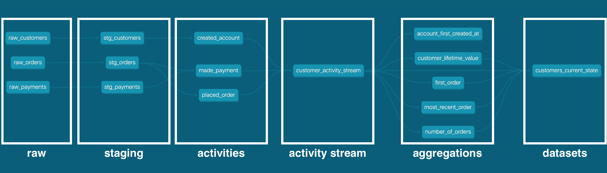

# activity_schema_demo
A demo dbt project using the `dbt-activity-schema` package on enriched jaffle shop data. This project walks through how to implement a pipeline that outputs the same [customers](https://github.com/dbt-labs/jaffle_shop/blob/main/models/customers.sql) table that is built in the [jaffle shop demo project](https://github.com/dbt-labs/jaffle_shop) from dbt Labs. The data has been enriched slightly to include `created_at` timestamps for the raw customer and payment data.


# Relevant Prior Knowledge
Users should be familiar with the following resources before using this demo repository:
1. [dbt](https://docs.getdbt.com/)
2. [The original Activity Schema spec](https://www.activityschema.com/)
3. `dbt-activity-schema` [package documentation](https://dbt-activity-schema.notion.site/dbt-activity-schema-1b4fff4d0b2d43c8a3fedd857a21b47e)

# Environment Setup
This demo was built using Python 3.10, and has been validated on `dbt-core` and `dbt-postgres` version 1.2.0 and 1.3.0.

# Model Organization
The `models` directory has the following structure:
```
models
├── customers
│   ├── activities
│   │   ├── created_account.sql
│   │   ├── customer_activity_stream.sql
│   │   ├── made_payment.sql
│   │   └── placed_order.sql
│   ├── aggregations
│   │   ├── account_first_created_at.sql
│   │   ├── customer_lifetime_value.sql
│   │   ├── first_order.sql
│   │   ├── most_recent_order.sql
│   │   └── number_of_orders.sql
│   └── datasets
│       └── customers_current_state.sql
└── staging
    ├── stg_customers.sql
    ├── stg_orders.sql
    └── stg_payments.sql

```
From the diagram above, there are two top-level subdirectories - `staging` and `customers`. `staging` is a data modeling layer that lightly transforms the raw source data, in adherence to the [recommended best practices from dbt Labs](https://docs.getdbt.com/guides/best-practices/how-we-structure/2-staging).

`customers` contains three more subdirectories:
* `activities` - contains each of the Activity data models, as well as the Activity Stream data model.
* `aggregations` - contains each Aggregation model that instructs from derived Activities. 
* `datasets` - contains each Dataset that is compiled from the Activity Stream and its Aggregations


# Lineage

When the data is modeled using the Activity Schema paradigm, it creates a well-organized flow of data through 6 layers: raw, staging, Activity, Activity Stream, Aggregation, and Dataset. This setup allows for the same Aggregations to be used in any Dataset, creating consistency in how columns are computed across use cases. It also makes for an easier experience when debugging data quality issues in Datasets. For example, if a column in a Dataset has a bug, that column maps directly to an Aggregation, which then maps back to an Attribute of an Activity.

